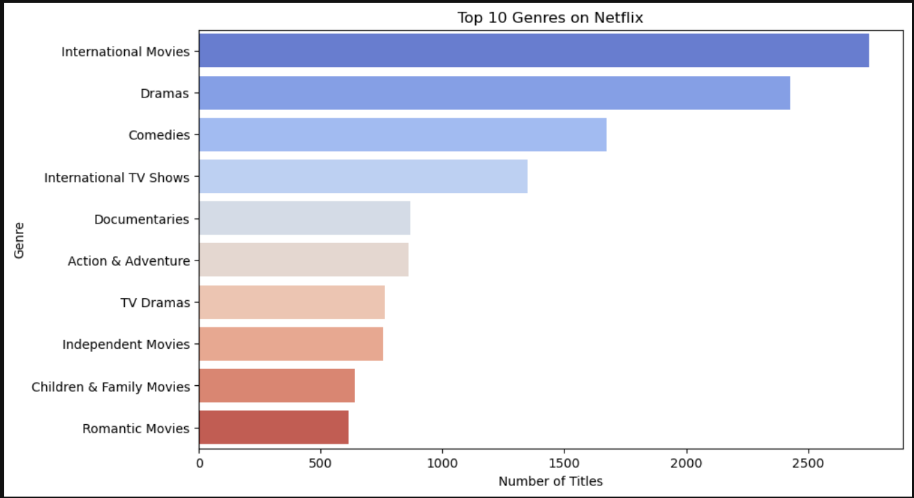
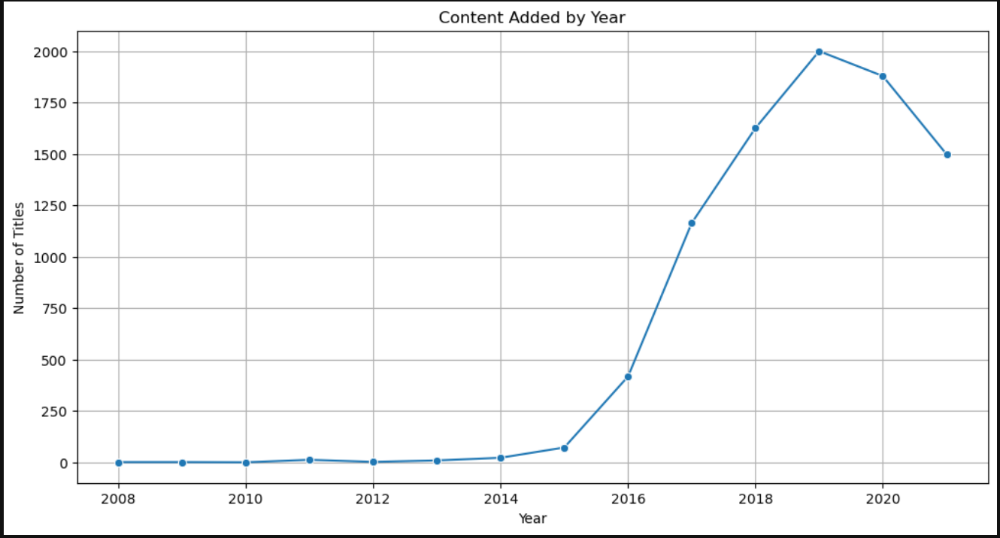
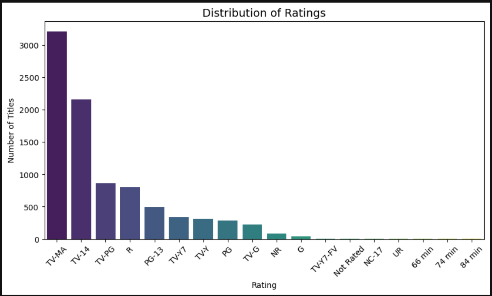

# Netflix-Data-Analysis-Visualization
Netflix Data Analysis & Visualization – A beginner-friendly EDA project using Python, Pandas, and Seaborn. Includes data cleaning, handling missing values, and creating insightful visualizations to explore trends in Netflix shows and movies.


---

# 📊 Netflix Data Analysis & Visualization


## 📌 Description

A beginner-friendly **Exploratory Data Analysis (EDA) project** on the **Netflix dataset** using Python. This project focuses on **data cleaning, handling missing values, and generating meaningful insights** through visualizations.

---

## 📂 Project Structure

```

Netflix-Data-Analysis/
│
├── data/
│   ├── raw_netflix_data.csv
|   └── cleaned_netflix_data.csv
|
├── notebooks/
│   └── netflix_analysis.ipynb
|
├── images/
│   ├── Top_Genres.png
│   ├── Release_trend.png
│   ├── Word_Cloud.png
│   └── Ratings_Distribution.png
|
├── requirements.txt
|
└── README.md

```

---

## ⚙️ Technologies Used

* **Python** (Pandas, NumPy, Matplotlib, Seaborn, WordCloud)
* **Jupyter Notebook**
* **Git & GitHub** for version control

---

## 🛠️ Installation & Setup

1. **Clone the repository**

   ```bash
   git clone https://github.com/VanshikaCodes/Netflix-Data-Analysis-Visualization
   cd Netflix-Data-Analysis-Visualization
   ```

2. **Create a virtual environment (optional but recommended)**

   ```bash
   python -m venv venv
   venv\Scripts\activate  # for Windows
   source venv/bin/activate  # for Mac/Linux
   ```

3. **Install dependencies**

   ```bash
   pip install -r requirements.txt
   ```

4. **Run the Jupyter Notebook**

   ```bash
   jupyter notebook
   ```

---

## 📊 Key Insights & Visualizations

### 1️⃣ **Top Genres on Netflix**



### 2️⃣ **Trend of Content Release Over Years**



### 3️⃣ **Word Cloud of Movie Titles**


### 4️⃣ **Ratings Distribution**



---

## 🚀 Features

* Clean and preprocess raw data (missing values, duplicates, inconsistent formats)
* Perform **Exploratory Data Analysis (EDA)** to uncover patterns
* Generate **interactive and static visualizations**
* Showcase findings in a structured and professional way

---

## 📈 Future Improvements

* Build interactive dashboards using **Plotly** or **Power BI**
* Add advanced analysis like clustering or recommendation engine
* Automate cleaning and analysis pipeline

---

## 🤝 Contributing

Contributions are welcome!

* Fork the repo
* Create a feature branch
* Submit a Pull Request


---

